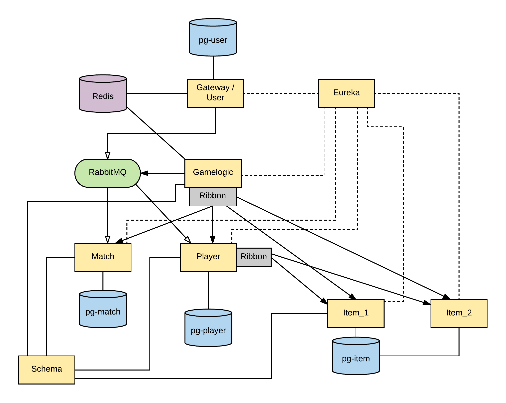
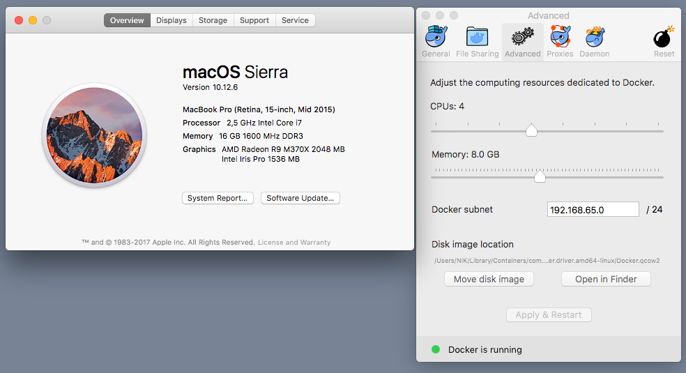

# ERN card game application
[Repository](https://github.com/NikitaZhevnitskiy/ern-card-game)   

### Travis
DEVELOP  
  
MASTER  
  

## About the game:
The game can be described as a turn based dice game. The main functionality is to fight other players. The fight is executed by both players throwing two dice (this is done by the computer). The player with the highest score
will attack the other one. If both dices from one player are equal, it will be a "critical hit." (meaning the damage is doubled).
After the match is over, a log will be returned and match result will be stored.

## How to UP
1. Run `mvn clean install` (add -DskipTests if you do not want to run tests)  
2. Run `docker-compose build`  
3. Run `docker-compose up -d`  

Up time depends on hardware (our case aprox. 2 mins)  
(Optional)  
`docker-compose logs -f` to get all logs 

## How to test the application
1. Run `mvn clean install` (add -DskipTests if you do not want to run tests)
2. Run `docker-compose build` in main folder (Be sure to also read Docker section further down this document)
3. Use the included Postman collection to manually test the endpoints.
4. Integration tests are disabled by default. In order to run them you need to add special parameter, which is
`-DskipIntegrationTests=false`
Example command: `mvn clean install -DskipIntegrationTests=false`

### How is the game implemented?
  

- Dotted lines are showing the service discovery with Eureka. 
- Redis used to store distributed session.  
- Ribbon used for load balancing intercommunication between modules
- RabbitMQ used for message delivery: create player when user created and match result persistence
- Gateway uses Zuul for load balancing and proxying. The gateway also stores user credentials and is used for authentication, via Redis.
- Eureka is used for service discovery.

### Technology-stack:
For our project we used the Spring framework, alongside Kotlin. In addition we also used some other libraries for production and testing.
For production we used Docker, Docker-compose and a lot of the Netflix-stack(Zuul, Eureka, Ribbon), in addition to RabbitMQ, Redis and Postgres databases.

For the testing we used TestContainers library for running Docker and Docker-Compose in end-to-end tests.
Also Wiremock and RestAssured for isolated tests where we needed to mock other modules.

#### Gamelogic
The main part of the game, the logic and execution is defined in the "Gamelogic" API. This API has two endpoints, one for finding 
an opponent and one for starting the fight.

GET /enemy is the endpoint for finding opponent:
It does this by querying the Player API for all players, and filters out itself. It then returns a "PlayerSearchDTO", which is an Dto
containing username, id and level of a potential opponent. This endpoint is made to be called multiple times by to until the 
User/"Consumer" of the API is satisfied with the opponent.

POST /fight is the endpoint starting the match:
This endpoint is supposed to be called after finding an opponent/enemy
from the GET /enemy endpoint. This endpoint then starts the game, executes all the dice throws and calculates damage. When one of the Players lose all their health, 
the match is over. After this, the method will persists a log of the match, to a seperate API, the MatchService. This is done using AMQP(RabbitMQ).
When everything else is done, the endpoint returns a "FightResultLogDto" containing the result of the match.

#### Responsibilities of group members
There are also three other APIs that are required for the game to work: Match, Player and Item. 
Each of these APIs are the responsibility of one member on our group.
All of these APIs provide POST, PUT, PATCH, GET and DELETE methods to modify Entities.

The Match API was developed and is the responsibility of Nikita. The purpose of this API is to store result from matches.

The Item API was developed and is responsibility of Robert. Items are used for changing the statistics of the Players(Like health and damage). 

Player API was developed and is responsibility of Eirik. The Player has a collection of Items. 
The API contains fields about player that is useful for fights, but not sensitive information like password(This is located inside Gateway/user module)

In addition there is another module called Schema. Here we expose Dto that each person created.(PlayerDto, ItemDto, etc..)
The reason for this is to avoid dependencies whenever possible, because no other module should use entity, just Dto's. 
This in turn makes it easier if one of us decide to change our API.

The Gamelogic, Gateway and e2etest modules were developed by all members of our group, using mostly pair-programming.

## Work process
### Git & Pair programming
After we finished implementation of ours separate modules, we used pair-programming for further development (gamelogic, security and e2e tests).
We have several reasons for it: charger issues with one machine, e2e test on windows with test containers. 
It was also very beneficial for finding bugs and typos.  
Therefore most of the commits in the project, are from Nikita's account.  
But we have several branches with features which did not make it to production. Examples of this are branches
for implementing Hystrix, Experience feature, and e2e tests for Gamelogic.

Git accounts:  
* [NikitaZhevnitskiy](https://github.com/NikitaZhevnitskiy)
* [EirikSkogstad](https://github.com/EirikSkogstad)
* [RobertEikeland](https://github.com/RobertEikeland)

#### Branches

In our git repo we used branches a few times. Mostly we used branches for changes we suspect
might cause problems with existing implementations. That way everyone was able to commit without
fear of causing problem with another student's implementation.

The main branch for our project was the Development branch. We also had a branch called Master, which was dedicated to
production code.

### Documentation for API's (SWAGGER)
First make sure to start docker-compose:

Swagger documentation is available under localhost:10000/api/v1/${name of the module}/swagger-ui.html for authenticated users.
To authenticate you can use Postman to create credentials, and use them in browser later.

It is also possible to manually start some endpoints by running them from IntelliJ. 
In that case all endpoints will have different ports, which is configured inside application.yml for each
API.

## Different emails inside the git log:
During the project, one of the members(Eirik) made a mistake when commiting. He forgot to properly set the Git config
on different computers and inside IntelliJ. Therefore it sometimes looks like more than 3 people have worked on the project.

However, all the commits were pushed from one Github user: [EirikSkogstad](https://github.com/EirikSkogstad)
All the different emails from this user are listed below, and is also registered on this Github account.
 - ze9ix@live.no
 - Skogeir15@student.westerdals.no
 - eirikskogstad13@gmail.com
 
## Docker

### Problems with Docker/Docker-compose
Due to the large amount of nodes we have in the projects, we sometimes encountered problems.
When we upped everything in Docker-compose, sometimes a few of the nodes/images would crash. 
After inspecting the logs and testing, we fixed the problem by upping the amount of memory Docker was allowed to use.
Having so many images packaged as FatJAR's will of course have a huge memory fotprint, so keep this in mind.

If some of the nodes crash, try to increase memory if you're using a MAC.
For Nikita 4GB on his MAC was too low, so we suggest increasing to higher than this. (8 GB perhaps)
   
### Remove all images 
docker rmi $(docker images -a -q)

### Further improvements

Further improvements would be to create a shop for the player to buy items. The items could increase the player's
health, or boost his damage. Items could also in the future be implemented to have more exciting effects different damage 
types and resistances.

Another improvement would be to implement another service for handling experience and level up for player. One way we considered
to implement this was by using AMQP to notify the ExperienceService when a match is over, and send the logs. The service
would then increase the experience- or level- field on PlayerEntity, based on the MatchResult.